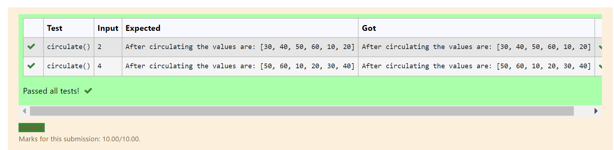

# Circulate-the-values-of-N-variables
## Aim:
To write a python program to circulate the n variables using function concept
## Equipment’s required:
PC
Anaconda - Python 3.7
## Algorithm:

### Step 1: 
import def circulate

### Step 2: 
prepare the list in each linear equations and assign it in np.array()

### Step 3: 
Get the value from the user for the number of rotation

### Step 4: 
Using the slicing concept rotate the list

### Step 5:
Print the coding and get the answer

### Step 6: 
End the program

## Program:
```
#Program to circulate the values of n variable
#Developed by:Vaishnavi M
#Registernumber:21500310
def circulate():
    l=[10,20,30,40,50,60]
    n=int(input())
    print ("After circulating the values are:",l[n:]+l[:n])
```

## Output:


## Result:
Thus, a program is successfully executed to circulate the values of n variables.
